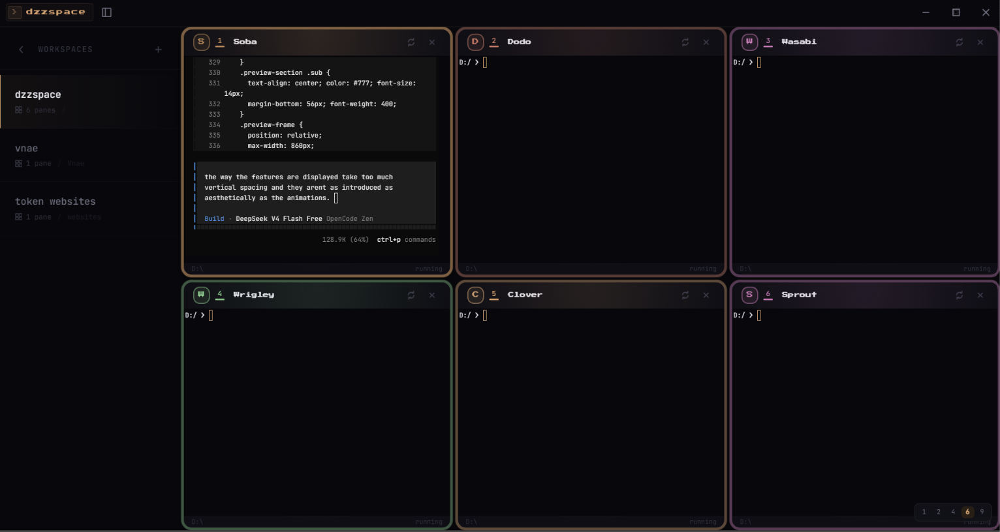

# dzzspace Website — UI Effects & Design System

A deep-dive into the visual design, animation techniques, and engineering decisions behind the dzzspace marketing website. Built to be a reusable blueprint for premium dark-mode product websites.

---

## Brand Identity

| Element | Detail |
|---|---|
| **Brand name** | dzzspace (lowercase, stylized as `dzzspace`) |
| **Logo** | Custom Shortcut-style logo (`official-logo.png`) — dark rounded square with brand mark |
| **Tagline** | *Premium multi-terminal workspace* |
| **Typography** | Press Start 2P (brand/headings), JetBrains Mono (code/terminals), Inter (UI/body) |
| **Accent color** | Gold `#d4a373` — used for shimmer, hover states, decorative accents, badges |
| **Background** | Near-black `#08080e` with warm tint — never pure `#000` |
| **Design principles** | Dark foundation, gold accent, no emojis, intentional restraint, no AI slop, hardware-accelerated CSS animations |
| **Signature effect** | Shimmer gold gradient sweep on brand text + breathing gold glow on imagery |
| **Signature easing** | `cubic-bezier(0.16, 1, 0.3, 1)` — fast start, slow deceleration with subtle overshoot |
| **Voice** | Technical, premium, concise — describes the product without hype |

---

## Table of Contents

1. [Design Philosophy](#1-design-philosophy)
2. [Color System](#2-color-system)
3. [Typography System](#3-typography-system)
4. [Hero Section](#4-hero-section)
5. [Ambient Background Orbs](#5-ambient-background-orbs)
6. [Scanlines Overlay](#6-scanlines-overlay)
7. [Navigation Bar](#7-navigation-bar)
8. [Feature Cards Grid](#8-feature-cards-grid)
9. [Showcase / Preview Section](#9-showcase--preview-section)
10. [Install Card](#10-install-card)
11. [Terminal Command Block](#11-terminal-command-block)
12. [Footer](#12-footer)
13. [Intersection Observer Scroll Animations](#13-intersection-observer-scroll-animations)
14. [Lenis Smooth Scrolling](#14-lenis-smooth-scrolling)
15. [Reusable Animation Patterns](#15-reusable-animation-patterns)
16. [Performance Decisions](#16-performance-decisions)
17. [Responsive Design](#17-responsive-design)
18. [How to Replicate This in Any Project](#18-how-to-replicate-this-in-any-project)

---

## 1. Design Philosophy

### Core Principles

- **Dark foundation, gold accent** — The page lives on `#08080e` (near-black with a warm tint). Gold (`#d4a373`) is the only accent color, used sparingly for maximum impact.
- **Subtlety over saturation** — Every glow, gradient, and animation is intentionally restrained. The goal is "premium" not "loud". Users should feel the quality without being able to point at any single effect.
- **Film-like depth** — The page simulates cinematic depth through layered glows, vignettes, floating elements, and smooth parallax-like motion. The background orbs, breathe animations, and gradient overlays all contribute to a sense of physical space.
- **No AI slop** — Every effect has a purpose. No lazy glassmorphism, no gradient blobs, no emojis. Intentional typography hierarchy (Press Start 2P → Inter → JetBrains Mono).
- **Hardware-first animation** — All animations use `transform` and `opacity` only, ensuring GPU acceleration. No jQuery, no animation libraries (except Lenis for scroll).

### The Mental Model

Think of the page as a theatrical stage:

| Layer | Element | Purpose |
|---|---|---|
| Backdrop | `#08080e` background | Dark canvas |
| Atmosphere | Ambient orbs (z-index 0) | Warm light sources floating in space |
| Floor | Page content (z-index 1) | The stage where content lives |
| Props | Cards, images, text blocks | The content itself |
| Lighting | Scanlines overlay (z-index 9999) | CRT texture, barely perceptible |
| Curtain | Scroll-triggered reveals | Elements enter from below with blur |

---

## 2. Color System

### Palette

```css
--gold:         #d4a373;   /* primary accent */
--gold-light:   #f0e6d0;   /* shimmer highlight */
--gold-deep:    #b88a5a;   /* shimmer shadow */
--bg:           #08080e;   /* main background */
--bg-panel:     #06060a;   /* card/image background */
--text:         #f0f0f5;   /* headings */
--text-body:    #c8c8d0;   /* body text */
--text-muted:   #777;      /* secondary text */
--text-dim:     #555;      /* de-emphasized */
--border:       rgba(255,255,255,0.02); /* subtle borders */
```

### Usage Rules

1. **Gold is a spotlight, not a paint bucket.** It appears on: hover states, active indicators, the shimmer title, decorative corner accents, and small UI badges. Never use it for body text or large backgrounds.
2. **Dark needs warmth.** Pure `#000` is avoided. `#08080e` has a slight warm tint. Card backgrounds drop to `#06060a` for separation.
3. **Text contrast is intentional.** Body text at `#777` on `#08080e` passes accessibility but feels soft and premium. Headings jump to `#f0f0f5` for hierarchy.
4. **Borders disappear.** At `rgba(255,255,255,0.02)`, borders are barely perceptible — just enough to define edges without drawing attention.

---

## 3. Typography System

### Font Stack

```css
/* Brand / Headings (pixel aesthetic) */
font-family: 'Press Start 2P', monospace;

/* Body / UI */
font-family: 'Inter', system-ui, sans-serif;

/* Code / Terminal blocks */
font-family: 'JetBrains Mono', monospace;
```

### Hierarchy

| Element | Font | Size | Weight | Letter Spacing |
|---|---|---|---|---|
| Hero title | Press Start 2P | 56px | 400 | 4px |
| Section headings | Press Start 2P | 22px | 400 | 1px |
| Feature card titles | Press Start 2P | 12px | 400 | 0 |
| Section labels | Press Start 2P | 8px | 400 | 5px |
| Body text | Inter | 14–16px | 400 | normal |
| Code/terminal | JetBrains Mono | 13px | 400 | normal |
| Small UI text | Inter | 10–12px | 500–600 | 0.08em |

### Why Press Start 2P?

It's a pixel/retro font that creates intentional tension with the smooth, modern UI effects (gradients, blurs, animations). The rigid blocky pixels against flowing gold gradients and smooth blurs creates visual interest. At small sizes (8px), it reads as a texture rather than text.

---

## 4. Hero Section

### Structure

```
┌─────────────────────────────────────────┐
│         hero-bg-glow (radial)           │
│           hero-grid (masked)            │
│  ┌─────────────────────────────────┐    │
│  │       hero-logo (floating)      │    │
│  │       section-label "tag"       │    │
│  │  dzzspace (shimmer gradient)    │    │
│  │       hero-sub (description)    │    │
│  │     [Get Started] [GitHub]      │    │
│  └─────────────────────────────────┘    │
└─────────────────────────────────────────┘
```

### Background Grid

```css
.hero-grid {
  background-image:
    linear-gradient(rgba(255,255,255,0.006) 1px, transparent 1px),
    linear-gradient(90deg, rgba(255,255,255,0.006) 1px, transparent 1px);
  background-size: 64px 64px;
  mask-image: radial-gradient(ellipse at 50% 40%, black 25%, transparent 70%);
}
```

The grid lines are nearly invisible (`0.006` opacity) but add subtle structure. The radial mask feathers the edges so the grid fades out naturally rather than cutting off sharply.

### Shimmer Title

```css
.hero h1 span {
  background: linear-gradient(135deg,
    #f0e6d0 0%,
    #d4a373 45%,
    #c8955a 70%,
    #b88a5a 100%
  );
  background-size: 200% auto;
  background-clip: text;
  -webkit-background-clip: text;
  -webkit-text-fill-color: transparent;
  animation: shimmer 4s ease-in-out infinite;
}

@keyframes shimmer {
  0%   { background-position: -200% center; }
  100% { background-position: 200% center; }
}
```

The shimmer sweeps a gold gradient across the text continuously. The 4-second cycle is slow enough to feel calm, fast enough to catch peripheral attention. See [UI-EFFECTS.md](../UI-EFFECTS.md) for the full breakdown.

### Floating Logo

```css
@keyframes float {
  0%, 100% { transform: translateY(0px); }
  50% { transform: translateY(-8px); }
}
```

A 5-second gentle float makes the logo feel suspended in space. The gold glow behind it (`radial-gradient`) reinforces the "light source" metaphor.

---

## 5. Ambient Background Orbs

### Concept

Three large, blurred gradient orbs float slowly behind the page content, simulating atmospheric light sources. This is the single most impactful "premium feel" addition — it transforms the page from flat dark to dimensional dark.

### Implementation

```html
<div class="ambient-orbs">
  <div class="ambient-orb ambient-orb--1"></div>
  <div class="ambient-orb ambient-orb--2"></div>
  <div class="ambient-orb ambient-orb--3"></div>
</div>
```

### Orb 1 — Large warm gold (top-left)

```css
.ambient-orb--1 {
  width: 700px; height: 700px;
  top: -200px; left: -200px;
  background: radial-gradient(circle,
    #d4a373 0%,
    rgba(212,163,115,0.15) 30%,
    transparent 65%
  );
  filter: blur(60px);
  animation: orbDrift1 22s ease-in-out infinite;
}
```

### Orb 2 — Medium deep gold (bottom-right)

```css
.ambient-orb--2 {
  width: 550px; height: 550px;
  bottom: -150px; right: -150px;
  background: radial-gradient(circle,
    #c8955a 0%,
    rgba(200,149,90,0.12) 30%,
    transparent 65%
  );
  filter: blur(60px);
  animation: orbDrift2 26s ease-in-out infinite;
}
```

### Orb 3 — Subtle white (center)

```css
.ambient-orb--3 {
  width: 350px; height: 350px;
  top: 50%; left: 50%;
  background: radial-gradient(circle,
    rgba(255,255,255,0.04) 0%,
    rgba(255,255,255,0.01) 30%,
    transparent 60%
  );
  filter: blur(60px);
  animation: orbDrift3 18s ease-in-out infinite;
}
```

### Drift Animations

Each orb has a unique path and timing so they never synchronize:

```css
@keyframes orbDrift1 {
  0%   { transform: translate(0, 0) scale(1); }
  25%  { transform: translate(80px, -60px) scale(1.08); }
  50%  { transform: translate(40px, 80px) scale(0.92); }
  75%  { transform: translate(-60px, -30px) scale(1.04); }
  100% { transform: translate(0, 0) scale(1); }
}
```

### Key Design Decisions

- **60px blur** — Heavy enough to be a soft glow, not a hard circle. At 80px+ they became invisible.
- **Solid colors at center** — Using hex `#d4a373` instead of `rgba(212,163,115,0.xx)` ensures the center is always vibrant. The gradient fades to transparent.
- **Pixel-based movement** — Using `translate(80px, -60px)` instead of percentage-based movement gives predictable, consistent drift regardless of viewport size.
- **Scale oscillation** — Each keyframe includes `scale()` variation so the orbs "breathe" in size, feeling organic.
- **22–26 second cycles** — Slow enough to be subliminal, not distracting.

### Critical Fix: Stacking Context

The orbs must be inside the `.page-content` wrapper (or share its stacking context). If placed outside, they render behind the content and are invisible:

```html
<div class="page-content">          <!-- z-index: 1 -->
  <div class="ambient-orbs">...</div>  <!-- inside = visible -->
  ...
</div>
```

---

## 6. Scanlines Overlay

```css
.scanlines {
  position: fixed;
  inset: 0;
  background: repeating-linear-gradient(
    0deg,
    transparent,
    transparent 2px,
    rgba(0,0,0,0.03) 2px,
    rgba(0,0,0,0.03) 4px
  );
  pointer-events: none;
  z-index: 9999;
}
```

Creates a subtle CRT scanline effect. At `rgba(0,0,0,0.03)`, each line is 3% opaque black — nearly imperceptible alone but collectively adding texture. Users will never notice it consciously, but the page would feel slightly "flat" without it.

---

## 7. Navigation Bar

### Structure

```
┌──────────────────────────────────────────────┐
│ [logo] dzzspace    Features Preview Install   │
│                     GitHub [Download]         │
├──────────────────────────────────────────────┤
│              ← 1px border-bottom              │
```

### Glass Effect

```css
nav {
  background: rgba(8,8,14,0.7);
  backdrop-filter: blur(20px) saturate(1.3);
  -webkit-backdrop-filter: blur(20px) saturate(1.3);
  border-bottom: 1px solid rgba(255,255,255,0.02);
}
```

A 70% opacity dark background with 20px blur creates the frosted glass effect. The `saturate(1.3)` slightly boosts color behind the glass for a richer look.

### Link Underline Animation

```css
.nav-links a::after {
  content: '';
  position: absolute; bottom: -2px;
  left: 0; right: 0;
  height: 1px;
  background: #d4a373;
  transform: scaleX(0);
  transition: transform 0.35s cubic-bezier(0.16, 1, 0.3, 1);
  transform-origin: left;
}
.nav-links a:hover::after { transform: scaleX(1); }
```

The gold underline scales from 0 to full width on hover, originating from the left. The cubic-bezier creates a slight overshoot feel at the end.

---

## 8. Feature Cards Grid

### Layout

```css
.features-grid {
  display: grid;
  grid-template-columns: 1fr 1fr;
  gap: 1px;
  background: rgba(255,255,255,0.02);
  border: 1px solid rgba(255,255,255,0.025);
  max-width: 900px;
  margin: 0 auto;
}
```

The 1px gap between cards acts as the grid border. The grid container's own background color shows through the gap, creating seamless borders without using `border` on each card.

### Card

```css
.feature-card {
  background: #08080e;
  padding: 40px 36px;
  position: relative;
  transition: background 0.6s;
  overflow: hidden;
}
```

### Corner Accent on Hover

```css
.feature-card::after {
  content: '';
  position: absolute;
  top: -1px; right: -1px;
  width: 0; height: 0;
  border-top: 2px solid rgba(212,163,115,0);
  border-right: 2px solid rgba(212,163,115,0);
  transition: width 0.6s, height 0.6s, border-color 0.6s;
}
.feature-card:hover::after {
  width: 20px;
  height: 20px;
  border-top-color: rgba(212,163,115,0.15);
  border-right-color: rgba(212,163,115,0.15);
}
```

The top-right corner expands from 0×0 to 20×20 on hover, creating a subtle "unfolding" effect. Only the top and right borders are visible, forming an L-shape.

### Numbered Badge

```css
.feature-card .card-num {
  position: absolute;
  bottom: 12px; right: 16px;
  font-family: 'JetBrains Mono', monospace;
  font-size: 10px;
  color: rgba(255,255,255,0.03);
  pointer-events: none;
  transition: color 0.5s;
}
.feature-card:hover .card-num { color: rgba(212,163,115,0.06); }
```

Nearly invisible at rest (`0.03` opacity). Hover makes it glow slightly. The numbers (01–06) are for the visitor's subconscious — they'll never consciously read them, but they add structure.

---

## 9. Showcase / Preview Section

### Structure

```
┌──────────────────────────────────────────┐
│          Section Label "Showcase"         │
│          "See it in action"              │
│          subtitle                         │
│  ┌────────────────────────────────────┐  │
│  │  ┌─┐                    ┌─┐       │  │
│  │  └─┘                    └─┘       │  │
│  │      showcase2.png                │  │
│  │                                   │  │
│  │      [Grid layout with...]        │  │
│  │  ┌─┐                    ┌─┐       │  │
│  │  └─┘                    └─┘       │  │
│  └────────────────────────────────────┘  │
└──────────────────────────────────────────┘
```

### Breathing Glow

```css
@keyframes breathe {
  0%, 100% {
    box-shadow:
      0 24px 64px rgba(0,0,0,0.5),
      0 0 0 1px rgba(212,163,115,0.04),
      0 0 40px rgba(212,163,115,0.04),
      0 0 0 0 rgba(212,163,115,0);
  }
  50% {
    box-shadow:
      0 28px 72px rgba(0,0,0,0.55),
      0 0 0 1px rgba(212,163,115,0.08),
      0 0 60px rgba(212,163,115,0.06),
      0 0 120px 20px rgba(212,163,115,0.04);
  }
}
```

The subtle shadow pulse simulates the image "breathing". At peak, the gold glow spreads to 120px with 20px spread. The effect is slow (6s cycle) so it feels organic.

### Film Gradient Overlay

```css
.showcase-frame::before {
  background: linear-gradient(
    180deg,
    rgba(212,163,115,0.04) 0%,   /* warm gold top */
    transparent 30%,               /* clear center */
    rgba(0,0,0,0.15) 85%,        /* vignette start */
    rgba(0,0,0,0.3) 100%         /* vignette end */
  );
  opacity: 0.6;
}
```

This replicates a cinematic film grade — warm highlights at the top, subtle vignette at the bottom. The 0.6 default opacity means it's always visible but subtle. On hover it increases to 1.0.

### Image Hover Zoom

```css
.showcase-frame img {
  transition: transform 1.2s cubic-bezier(0.16, 1, 0.3, 1);
}
.showcase-frame:hover img {
  transform: scale(1.012);
}
```

A barely-perceptible 1.2% zoom on hover. The 1.2s duration and cubic-bezier make it feel like a slow cinematic pull.

### Corner Accents

```css
.corner-tl { top: 12px; left: 12px;
  border-top: 1.5px solid rgba(212,163,115,0.2);
  border-left: 1.5px solid rgba(212,163,115,0.2);
}
```

Four corners (tl, tr, bl, br) that fade in on hover at 0.2 gold opacity. These frame the image like a mat in a picture frame, adding physicality.

### Caption Label

```css
.showcase-label {
  background: rgba(8,8,14,0.6);
  backdrop-filter: blur(8px);
  border: 1px solid rgba(212,163,115,0.04);
  padding: 10px 20px;
  border-radius: 4px;
  font-size: 10px;
  color: rgba(255,255,255,0.25);
}
```

A frosted glass pill that fades in at the bottom of the image on hover. Uses `backdrop-filter: blur(8px)` for the glass effect, with a thin gold border tint.

---

## 10. Install Card

### Structure

```
┌──────────────────────────────────────┐
│           [official-logo]            │
│              v1.1.0                  │
│             Windows                  │
│      Windows 10 / 11 · 79 MB        │
│     Download Installer ↓             │
└──────────────────────────────────────┘
```

### Logo with Depth

```css
.install-card .icon-wrap img {
  width: 56px; height: 56px;
  border-radius: 8px;
  box-shadow:
    0 8px 32px rgba(0,0,0,0.5),
    0 0 0 1px rgba(212,163,115,0.08),
    0 0 20px rgba(212,163,115,0.04);
  transition: box-shadow 0.5s, transform 0.5s;
}
.install-card:hover .icon-wrap img {
  box-shadow:
    0 16px 48px rgba(0,0,0,0.6),
    0 0 0 1px rgba(212,163,115,0.2),
    0 0 40px rgba(212,163,115,0.12),
    0 0 80px rgba(212,163,115,0.04);
  transform: scale(1.06);
}
```

The official logo sits inside a multi-layered shadow: a deep dark drop shadow for physical depth, a thin gold ring for separation, and a soft gold glow for ambiance. On hover, the glow triples and the logo lifts (scale 1.06).

### Animated Float + Glow

```css
@keyframes iconFloat {
  0%, 100% { transform: translateY(0px); }
  50% { transform: translateY(-4px); }
}
@keyframes glowPulse {
  0%, 100% { opacity: 0.5; transform: scale(1); }
  50% { opacity: 1; transform: scale(1.1); }
}
```

The icon gently floats upward 4px on a 4-second cycle. The gold glow behind it pulses in/out simultaneously. On hover, both animations pause so the effects don't fight each other.

---

## 11. Terminal Command Block

```html
<div class="terminal-cmd">
  <div class="terminal-cmd-header">
    <div class="terminal-cmd-dot"></div>
    <div class="terminal-cmd-dot"></div>
    <div class="terminal-cmd-dot"></div>
  </div>
  <div class="terminal-cmd-content">
    <div><span class="prompt">~ ❯</span> <span class="cmd">npx dzzspace</span></div>
    <div style="margin-top: 6px; color: #666;">Installing dzzspace v1.1.0 ... done.</div>
  </div>
</div>
```

A minimal terminal mockup with three colored dots (pink, gold, green) and a JetBrains Mono command. The cursor blinks using the same `pulseGlow` animation used elsewhere for consistency.

---

## 12. Footer

```css
footer {
  padding: 56px 0 40px;
  text-align: center;
  border-top: 1px solid rgba(255,255,255,0.015);
}
```

Minimal footer with logo, nav links, and copyright. The `0.015` opacity border is the most subtle possible separation — just enough to define the section boundary.

---

## 13. Intersection Observer Scroll Animations

### Implementation

```javascript
const observer = new IntersectionObserver((entries) => {
  entries.forEach((entry) => {
    if (entry.isIntersecting) {
      const delay = entry.target.dataset.delay;
      if (delay) {
        entry.target.style.transitionDelay = delay + 's';
      }
      entry.target.classList.add('visible');
      observer.unobserve(entry.target);
    }
  });
}, { threshold: 0.08, rootMargin: '0px 0px -40px 0px' });

document.querySelectorAll('.reveal-card, .anim-fade-up, .section-line')
  .forEach((el) => observer.observe(el));
```

### Animation Classes

#### `.anim-fade-up` — Simple fade + translate

```css
.anim-fade-up {
  opacity: 0;
  transform: translateY(40px);
  transition: opacity 0.9s cubic-bezier(0.16, 1, 0.3, 1),
              transform 0.9s cubic-bezier(0.16, 1, 0.3, 1);
}
.anim-fade-up.visible {
  opacity: 1;
  transform: translateY(0);
}
```

Used for: section labels, headings, subtitles.

#### `.reveal-card` — Blur + fade + translate

```css
.reveal-card {
  opacity: 0;
  filter: blur(8px);
  transform: translateY(32px);
  transition: opacity 1s cubic-bezier(0.16, 1, 0.3, 1),
              filter 1s cubic-bezier(0.16, 1, 0.3, 1),
              transform 1s cubic-bezier(0.16, 1, 0.3, 1);
}
.reveal-card.visible {
  opacity: 1;
  filter: blur(0);
  transform: translateY(0);
}
```

The blur creates a "coming into focus" effect that feels more cinematic than a simple fade. The 1s duration is intentionally slow for a premium feel. Used for: feature cards, showcase frame, install card, terminal block.

### Staggered Delays

Each animated element uses `data-delay` for staggered sequencing:

```html
<div class="feature-card reveal-card" data-delay="0.04">  <!-- 1st -->
<div class="feature-card reveal-card" data-delay="0.10">  <!-- 2nd -->
<div class="feature-card reveal-card" data-delay="0.16">  <!-- 3rd -->
```

The delays are 0.04–0.34s across the 6 feature cards, creating a cascade effect as the user scrolls.

### The cubic-bezier(0.16, 1, 0.3, 1)

```css
cubic-bezier(0.16, 1, 0.3, 1)
```

This is the dzzspace signature easing curve. It starts fast, decelerates smoothly, and has a very subtle overshoot feel at the end. It's used for ALL animations across the entire site and app for consistency.

Visual representation: starts at 16% of the way to the target, accelerates to 100% quickly, then decelerates to 30% before coasting to 1. This creates a natural "settling" feel.

---

## 14. Lenis Smooth Scrolling

```html
<script src="https://unpkg.com/lenis@1.1.18/dist/lenis.min.js"></script>
<script>
const lenis = new Lenis({
  lerp: 0.08,            // interpolation — lower = smoother
  wheelMultiplier: 0.8,  // slightly reduced scroll speed
  touchMultiplier: 1.2,  // normal touch feel
});
function raf(time) { lenis.raf(time); requestAnimationFrame(raf); }
requestAnimationFrame(raf);
</script>
```

Lenis provides smooth, inertia-based scrolling with customizable easing. Key decisions:

- **lerp: 0.08** — Smooth but responsive. Lower values (0.05) feel more "rubber band" but can cause motion sickness. Higher values (0.12) feel snappier but less premium.
- **wheelMultiplier: 0.8** — Slightly reduced scroll speed makes the page feel denser and more deliberate to scroll through.
- **No infinite scroll wrapper** — Lenis works on the native scroll, so no layout restructuring needed.

**Important**: Remove native `scroll-behavior: smooth` from CSS when using Lenis to prevent conflicts.

---

## 15. Reusable Animation Patterns

### Pattern 1: Shimmer (Gold Gradient Sweep)

```css
.shimmer {
  background: linear-gradient(135deg, #light, #base, #deep, #shadow);
  background-size: 200% auto;
  background-clip: text;
  -webkit-background-clip: text;
  -webkit-text-fill-color: transparent;
  animation: shimmer 4s ease-in-out infinite;
}
@keyframes shimmer {
  0%   { background-position: -200% center; }
  100% { background-position: 200% center; }
}
```

### Pattern 2: Breathe (Shadow Pulse)

```css
@keyframes breathe {
  0%, 100% { box-shadow: /* rest state */; }
  50%      { box-shadow: /* peak glow */; }
}
```

### Pattern 3: Float (Gentle Vertical Drift)

```css
@keyframes float {
  0%, 100% { transform: translateY(0); }
  50%      { transform: translateY(-8px); }
}
```

### Pattern 4: Drift (Multi-Directional Orbital)

```css
@keyframes drift {
  0%   { transform: translate(0, 0) scale(1); }
  25%  { transform: translate(Xpx, Ypx) scale(S); }
  50%  { transform: translate(Xpx, Ypx) scale(S); }
  75%  { transform: translate(Xpx, Ypx) scale(S); }
  100% { transform: translate(0, 0) scale(1); }
}
```

### Pattern 5: Corner Accent (Hover Reveal)

```css
.element::after {
  position: absolute;
  top: -1px; right: -1px;
  width: 0; height: 0;
  border-top: 2px solid transparent;
  border-right: 2px solid transparent;
  transition: width 0.5s, height 0.5s, border-color 0.5s;
}
.element:hover::after {
  width: 20px; height: 20px;
  border-color: var(--accent);
}
```

### Pattern 6: Cinematic Image Overlay

```css
.image-frame::before {
  content: '';
  position: absolute; inset: 0;
  background: linear-gradient(
    180deg,
    rgba(accent, 0.04) 0%,
    transparent 30%,
    rgba(0,0,0,0.15) 85%,
    rgba(0,0,0,0.3) 100%
  );
  pointer-events: none;
  z-index: 2;
}
```

---

## 16. Performance Decisions

### GPU Acceleration

All animations use only `transform` and `opacity` properties, which are GPU-accelerated. No `width`, `height`, `margin`, or `top/left` animations that trigger layout recalculations.

### Bundling

Zero JavaScript animation libraries (except Lenis for scroll). All effects are CSS. This means:
- No JS framework overhead for animations
- CSS animations are handled by the browser's compositor thread
- No layout thrashing from JS-driven animation loops

### Image Loading

```html

```

The showcase images use native lazy loading. Combined with Lenis, images only load when they're about to enter the viewport.

### The 60px Blur Tradeoff

Blur filters are GPU-intensive. The 60px blur on the ambient orbs is the heaviest effect on the page. However:
- Only 3 orb elements
- They use `will-change: transform` for layer promotion
- The blur is applied once per frame, not recalculated continuously
- Fixed positioning means they're composited on a single layer

### What's NOT Used

- **framer-motion** — removed in favor of pure CSS transitions
- **Three.js / WebGL** — overkill for 2D orbs, pure CSS is lighter
- **GSAP** — IntersectionObserver + CSS transitions handle everything
- **jQuery** — vanilla JS for the 15 lines of script

---

## 17. Responsive Design

### Breakpoints

```css
@media (max-width: 768px) {
  .hero h1 { font-size: 30px; letter-spacing: 2px; }
  .hero-logo img { width: 72px; height: 72px; }
  .features-grid { grid-template-columns: 1fr; }
  nav .nav-links a:not(.nav-cta) { display: none; }
  .showcase-item .showcase-label { display: none; }
}

@media (max-width: 480px) {
  .hero h1 { font-size: 22px; letter-spacing: 1px; }
  .hero-sub { font-size: 14px; }
  .hero-actions { flex-direction: column; align-items: center; }
}
```

### Design Decisions for Mobile

- **Single-column grid** at 768px — feature cards stack vertically
- **Hero title shrinks** from 56px → 30px → 22px
- **Nav links hidden** — only the CTA button remains visible
- **Showcase labels hidden** — too small to be useful on mobile
- **CTA buttons stack** vertically on very small screens
- **Ambient orbs are unaffected** — their fixed positioning and pixel-based animation works at any viewport

---

## 18. How to Replicate This in Any Project

### Step 1: Foundation

```html
<style>
  body {
    background: #08080e;
    color: #c8c8d0;
    font-family: 'Inter', system-ui, sans-serif;
  }
  ::selection { background: rgba(212,163,115,0.3); color: #f0f0f5; }
</style>
```

### Step 2: Add the Signature Easing

```css
* {
  transition-timing-function: cubic-bezier(0.16, 1, 0.3, 1);
}
```

### Step 3: Add Ambient Orbs

Copy the `.ambient-orbs`, `.ambient-orb`, and `@keyframes orbDrift*` blocks from section 5 above. Adjust colors to match your brand accent.

### Step 4: Add Scanlines

Copy the `.scanlines` CSS from section 6.

### Step 5: Add Scroll Reveals

```javascript
const observer = new IntersectionObserver((entries) => {
  entries.forEach((entry) => {
    if (entry.isIntersecting) {
      const delay = entry.target.dataset.delay;
      if (delay) entry.target.style.transitionDelay = delay + 's';
      entry.target.classList.add('visible');
      observer.unobserve(entry.target);
    }
  });
}, { threshold: 0.08, rootMargin: '0px 0px -40px 0px' });

document.querySelectorAll('.reveal-card, .anim-fade-up')
  .forEach((el) => observer.observe(el));
```

### Step 6: Add Lenis

```html
<script src="https://unpkg.com/lenis@1.1.18/dist/lenis.min.js"></script>
<script>
  const lenis = new Lenis({ lerp: 0.08, wheelMultiplier: 0.8 });
  function raf(time) { lenis.raf(time); requestAnimationFrame(raf); }
  requestAnimationFrame(raf);
</script>
```

### Step 7: Add Your Content with Animation Classes

```html
<div class="reveal-card" data-delay="0.1">
  <!-- your card content -->
</div>
<h2 class="anim-fade-up" style="transition-delay: 0.08s">
  Your Heading
</h2>
```

### Step 8: Add Hover Effects

- Corner accents via `::after` pseudo-elements
- Image zoom via `transform: scale()` on `:hover`
- Shadow depth via `box-shadow` transitions
- Gold border glow via `border-color` transitions

### Step 9: Tune Colors

Replace `#d4a373` and its variants with your accent color. Keep the dark background (`#08080e` or similar) and use your accent sparingly for maximum impact.

### The Formula

> **Dark canvas** (`#08080e`) + **Ambient glow** (blurred orbs) + **Scroll reveals** (blur→focus) + **Smooth scroll** (Lenis) + **Subtle texture** (scanlines) + **Intentional accent** (gold, used sparingly) = **Premium feel**

The specific colors, fonts, and timing values are adjustable. The architecture — dark foundation, atmospheric light, restrained accent, cinematic transitions — is what creates the "premium" perception.
